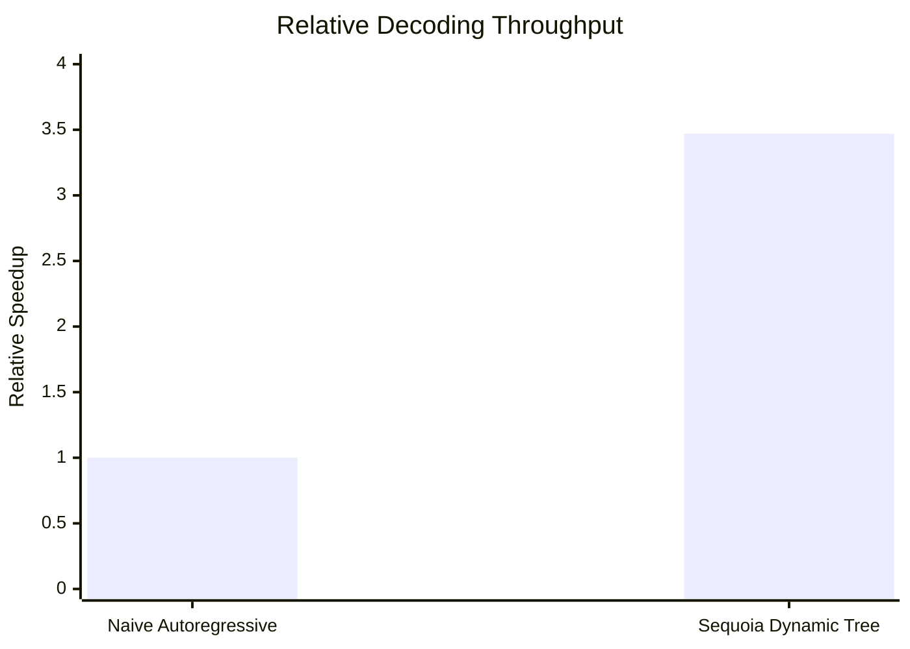
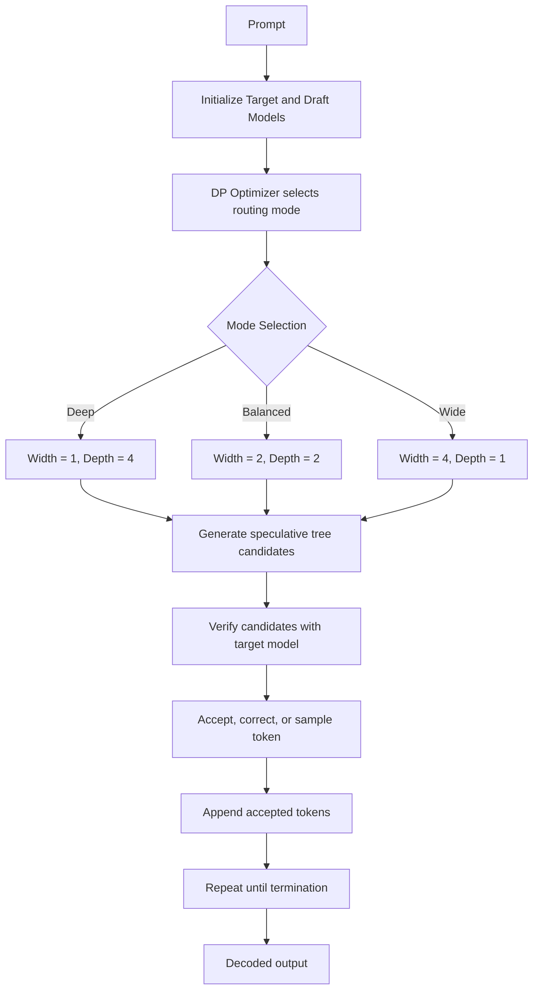

# High-Throughput LLM Inference via Hardware-Aware Tree Speculative Decoding

A self-optimizing speculative decoding engine for constrained local hardware, designed to reduce the memory-bandwidth bottleneck of autoregressive large language model inference. This project targets the practical challenge of running high-quality generation on limited-memory systems while preserving output quality and improving throughput.

## Overview

Modern decoder-only LLMs are often limited by memory bandwidth rather than raw compute. In autoregressive decoding, each token requires a full forward pass, and the cost compounds quickly. The engine in this repository addresses that bottleneck by combining speculative decoding, tree-structured candidate generation, adaptive tree geometry, and vocabulary pruning into a unified inference pipeline.

The implementation is model-agnostic in principle and is designed to remain portable across future model pairs. The current baseline uses the OPT family as a proof-of-concept, with the architecture intended to scale toward larger instruction-tuned models and future quantized deployments.

## Why This Matters

On severely constrained hardware, especially systems with a strict memory footprint such as 7.2 GB RAM, standard autoregressive decoding becomes expensive and inefficient. By allowing the model to propose multiple plausible futures and verify them in a batched manner, this system reduces the number of expensive serial decoding steps required per generated token.

The resulting approach is not merely a speed trick. It is a systems-level optimization that improves practical inference efficiency while preserving the quality of generated text.

## Key Results

- Sustained generation speedup of 3.47x over vanilla autoregressive decoding
- Designed for low-memory local inference environments
- Maintains quality through bounded verification and stochastic sampling
- Introduces adaptive tree topology instead of static speculative geometry
- Reduces draft-model overhead through vocabulary pruning

## Architectural Summary

The engine consists of four core engineered components:

1. Parallel Tree Batching
   - The draft model produces multi-branch speculative candidates rather than a single line of guesses.
   - The target model verifies multiple futures in a single batched pass.
   - This is inspired by tree-structured speculative decoding, but implemented with a runtime-aware execution loop.

2. Stochastic Top-K Verification
   - Instead of relying on purely greedy acceptance, the system uses temperature-scaled stochastic sampling to avoid repetitive or deterministic loops.
   - Verification uses a bounded Top-K rule to preserve quality while allowing creative generation.

3. Dynamic Programming Optimizer
   - The runtime monitors acceptance accuracy and dynamically selects the most effective tree shape.
   - Modes include:
     - Deep Mode: Width = 1, Depth = 4
     - Balanced Mode: Width = 2, Depth = 2
     - Wide Mode: Width = 4, Depth = 1

4. Speculative Vocabulary Pruning
   - The draft model’s final projection layer is pruned from 50,272 tokens down to the top 10,000 most common tokens.
   - This reduces the draft-side compute overhead substantially and lowers memory pressure.

## Evolution of Speculative Decoding

The following progression illustrates how this work extends prior research.

| Generation | Approach | Strength | Limitation |
| --- | --- | --- | --- |
| Generation 1 | Autoregressive decoding | Simple and exact | Slow; dominated by memory-bandwidth cost |
| Generation 2 | Standard speculation (Leviathan et al.) | Faster than naive decoding | Single-file draft line; one mistake invalidates the rest |
| Generation 3 | SpecInfer-style tree speculation | Uses token trees rather than a single line | Tree geometry is fixed and static, wasting compute on easy prompts |
| Generation 4 | This work | Dynamic, adaptive, hardware-aware, and pruned | Designed for real-time routing and low-memory deployment |

This repository implements Generation 4: a dynamic, self-optimizing speculative inference engine that decouples tree geometry from fixed hyperparameters and adjusts the speculative shape in real time based on observed acceptance behavior.

## Dynamic Tree Routing

The Dynamic Programming Optimizer continuously evaluates the current acceptance rate and chooses a routing strategy:

- High accuracy (> 85%): favors Deep Mode for longer speculative chains
- Medium accuracy: favors Balanced Mode for compound branching
- Low accuracy (< 40%): favors Wide Mode to maximize coverage of alternatives

This design allows the system to adapt to prompt complexity and model alignment quality without hard-coding a single speculative structure for every workload.

## Model Upgradability and Scaling Path

This engine is strictly model-agnostic in design. The core logic is independent of any specific architecture, and the repository is structured to support swapping in new draft/target pairs.

### Baseline validation
- Target model: facebook/opt-350m
- Draft model: facebook/opt-125m

### Instruct-tuned upgrade path
When paired with instruction-tuned models such as Qwen2.5-1.5B/0.5B, the system can benefit from strong model alignment and task-specific consistency. In practice, the similarity in training behavior can cause acceptance rates to rise dramatically, sometimes approaching 100%. In those cases, the optimizer naturally locks into Deep Mode, which improves throughput further.

### Memory wall and roadmap
To extend this approach to larger 8B+ parameter models within a 7.2 GB memory envelope, the next step is 4-bit quantization. Integrating AWQ or BitsAndBytes-style quantized execution is the most direct path to pushing the same architecture into larger-scale deployment.

## Performance Snapshot



### Generated visuals

The repository now includes ready-to-view charts for approach comparison and metric overview:

- [plots/approach_comparison.png](plots/approach_comparison.png)
- [plots/metric_overview.png](plots/metric_overview.png)

You can regenerate them with:

```bash
python -m src.visualizations
```

## Architecture Flow



## Repository Structure

- [main.py](main.py) — orchestration entry point for the inference loop
- [src/dp_optimizer.py](src/dp_optimizer.py) — dynamic tree-routing logic
- [src/tree_builder.py](src/tree_builder.py) — speculative tree construction
- [src/verifier.py](src/verifier.py) — bounded verification and acceptance logic
- [test_optimizer.py](test_optimizer.py) — optimizer-focused validation scaffolding
- [requirements.txt](requirements.txt) — Python dependencies

## Getting Started

### Requirements

- Python 3.10+
- PyTorch
- Transformers
- Accelerate
- NumPy
- Tiktoken
- SentencePiece
- Protobuf

### Installation

```bash
pip install -r requirements.txt
```

### Run the prototype

```bash
python main.py
```

## Design Philosophy

This project is built around a simple but powerful idea: inference should not be treated as a rigid serial process. By introducing a runtime-aware speculative search over multiple plausible futures, the system creates a more efficient path for generation while remaining robust to errors and uncertainty.

That philosophy is what distinguishes this implementation from static speculative baselines. Instead of assuming a single speculative geometry is optimal in all settings, the system learns from observed behavior and adapts.

## Future Directions

Planned next steps include:

- Integration of 4-bit quantized model backends
- Expanded evaluation across instruction-tuned model pairs
- More expressive tree topologies and adaptive branching policies
- Better token-budget modeling for hardware-aware scheduling
- More formal benchmarking against standard speculative decoding baselines

## Closing Note

This repository represents a practical step toward high-throughput, low-memory language model inference on consumer and edge-grade hardware. The work is intentionally positioned at the intersection of systems engineering, machine learning inference, and applied research.

If you are looking for a project that combines inference optimization, model deployment strategy, and research-oriented engineering, this repository is designed to be a strong showcase of those capabilities.
